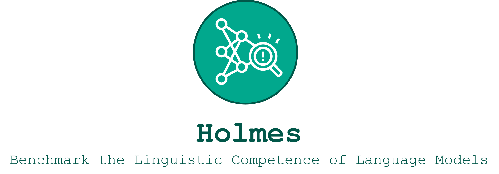

    

        <b><a href="https://holmes-benchmark.github.io/"><b>Project Page</b></a> |</b>
        <b><a href="https://holmes-explorer.streamlit.app/">Explorer 🔎</a> |</b>
        <b><a href="https://holmes-leaderboard.streamlit.app/">Leaderboard 🚀</a></b>
    

[Holmes 🔎](https://holmes-benchmark.github.io) is benchmark dedicated to asses the linguistic competence of language models and features:
As part of this benchmark, this repository allows to run the [Holmes Leaderboard 🚀](https://holmes-leaderboard.streamlit.app/) and [Holmes Explorer 🔎](https://holmes-explorer.streamlit.app/) locally including: 

* __Leaderboard__: allow to explorer the leaderboard across the officially evaluated.
* __Explorer__: allow to explorer the results in more detail such as comparing specific language models for distinct phenomena or probing datasets.
* __Custom Data__: after evaluating custom langauge models with the [Holmes 🔎 evaluation](https://github.com/Holmes-Benchmark/holmes-evaluation) suit, you can use this toolbox to explore the results.

Missing a specific feature? [email us](holmesbenchmark@gmail.com) or open an issue.

    
    
    
    
    

# 🔎 How does it work?

## 🔎️ Setting up the environment
To run the interactive user interface ensure your setup meets the following requirements:
* Python version 3.10.
* Install all necessary packages using pip install -r requirements.txt`.

## 🔎 Custom Data
If you evaluate a custom model and produced a custom result file, put it into the data folder. 

## 🔎 Run Explorer and Leaderboard

The explorer script (`explorer.py`) provides the following argument:
* `--result_file` (optional) a custom result file, for example `data/custom_results.csv`. Note, this can be a Holmes 🔎 or FlashHolmes ⚡ results file.

The leaderboard script (`explorer.py`) provides the following argument:
* `--holmes_result_file` (optional) a custom result file of the full benchmark , for example `data/custom_holmes_results.csv`.
* `--flash_holmes_result_file` (optional) a custom result file of the efficient benchmark , for example `data/custom_holmes_results.csv`.

# 🔎Disclaimer
We provide datasets in a specific format without endorsing their quality, fairness, or confirming your licensing rights. 
Users must verify their permissions under the dataset's license and properly credit the dataset owner.

If you own a dataset and want to update or remove it from our library, please contact us. 
Additionally, if you wish to include your dataset or model for evaluation, feel free contact as well!